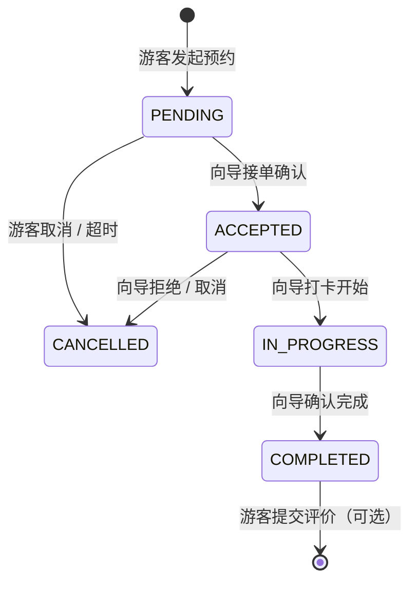

# TourPal 系统架构说明

> 作者：薛千恒（架构设计负责人）
> 对应文档：《TourPal 核心架构拆解》WBS 工作分解结构

---

## 三端架构概览

```
┌──────────────────┐  ┌──────────────────┐  ┌──────────────────┐
│  游客端 Tourist   │  │  向导端 Guide     │  │  管理端 Admin    │
│  英文界面         │  │  中文界面         │  │  /admin 路由     │
│  搜索/预约/评价   │  │  接单/打卡/履约   │  │  审核/监控/统计  │
└────────┬─────────┘  └────────┬─────────┘  └────────┬─────────┘
         └──────────────────────┴────────────────────┘
                                │
               ┌────────────────▼────────────────┐
               │  Next.js 13 App Router           │
               │  API Routes (TypeScript)         │
               │  NextAuth.js 身份认证             │
               └────────────────┬────────────────┘
                                │
               ┌────────────────▼────────────────┐
               │  Prisma ORM                      │
               │  MongoDB Atlas（云端）            │
               │  Railway 部署                    │
               └─────────────────────────────────┘
```

---

## 订单状态机（WBS 2.2）



---

## 数据模型关系（WBS 2.1）

```
User ──1:N──▶ Listing      向导发布多个体验产品
User ──1:N──▶ Reservation  游客创建多个预约订单
Listing ──1:N──▶ Reservation  一个体验可被多次预约
Reservation ──0:1──▶ Review   完成后可提交一条评价
```

---

## 关键设计决策

| 决策点 | 方案 | 原因 |
|--------|------|------|
| 基础框架 | Airbnb 开源二次开发 | 复用率约 50%（Make-or-Buy 结论）|
| 数据库 | MongoDB Atlas 云端 | 无本地部署，文档型适合多字段体验产品 |
| ORM | Prisma | 类型安全，配合 TypeScript 减少运行时错误 |
| 部署 | Railway | 支持 MongoDB 连接，一键部署，免费额度满足课程 |
| 认证 | NextAuth.js | 内置 Google OAuth + 邮箱注册 |